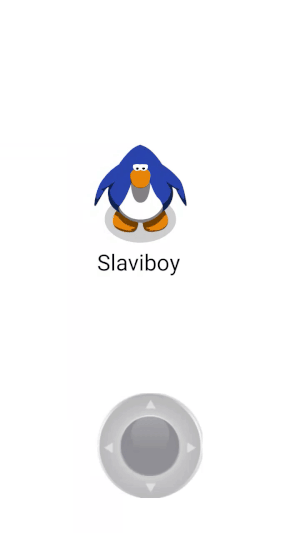

# SwitchController
Switch Controller(Java) for controlling 2D and 3D objects
 

## Add to your project
Add the jitpack maven repository
```
allprojects {
  repositories {
    ...
    maven { url 'https://jitpack.io' }
  }
}
``` 
Add the dependency
```
dependencies {
  implementation 'com.github.slaviboy:SwitchController:0.1.0'
}
```


## Documentation
### Examples
Add switch controller using **xml**
```xml
<com.slaviboy.switchcontroller.SwitchController
        android:id="@+id/controller"
        android:layout_width="200dp"
        android:layout_height="200dp"
        app:active_opacity="1"
        app:inactive_opacity="0.5"
        app:is_sticky="false"
        app:detect_transparency="false"
        app:keep_inside="false"
        android:layout_marginBottom="5dp"
        app:layout_constraintBottom_toBottomOf="parent"
        app:layout_constraintLeft_toLeftOf="parent"
        app:layout_constraintRight_toRightOf="parent" />

```

Add switch controller using **java**
```JAVA
// get parent view
View parentView = findViewById(android.R.id.content);

// get your drawables from resources
Drawable bg = getResources().getDrawable(R.drawable.bg_controller);
Drawable fg = getResources().getDrawable(R.drawable.fg_controller);

SwitchController switchController = new SwitchController.Builder(this)
                .withParentView(parentView)
                .withWidth(300)
                .withHeight(300)
                .withBackgroundDrawable(bg)
                .withForegroundDrawable(fg)
                .withInactiveAlpha(0.5f)
                .withActiveAlpha(1)
                .withIsSticky(false)
                .withDetectTransparency(false)
                .withKeepInside(true)
                .build();
```

### Add Listener
```JAVA
switchController.setControllerListner(new SwitchController.ControllerListener() {
  @Override
  public void onDirectionChange(int id, int direction, int action) {
                
  }

  @Override
  public void onMove(int id, double angle, double distance) {

  }
});
```

### Properties
* **active_opacity** - *(default:1)* opacity when controller is in active state
* **inactive_opacity** - *(default:1)* opacity when controller is in inactive state
* **is_sticky** - *(default:false)* if controller should stick to its main four directions
* **detect_transparency** - *(default:false)* if events should be detected on transparent area
* **keep_inside** - *(default:false)* if foreground should be kept inside the background
